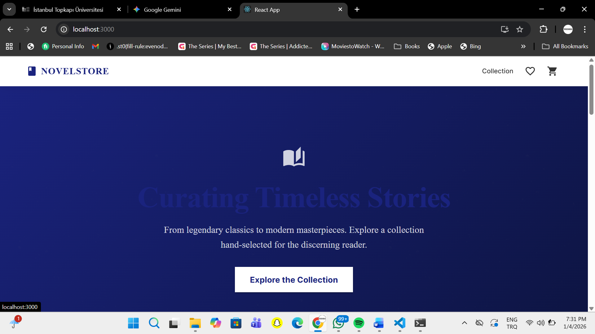
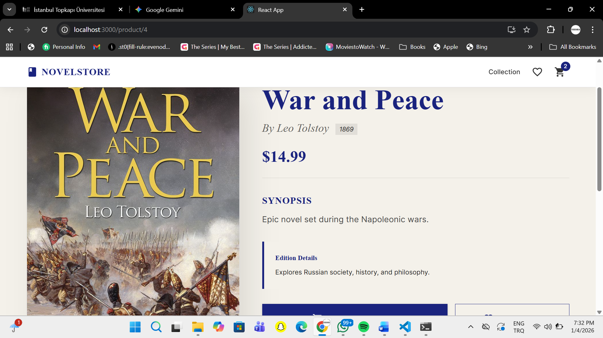
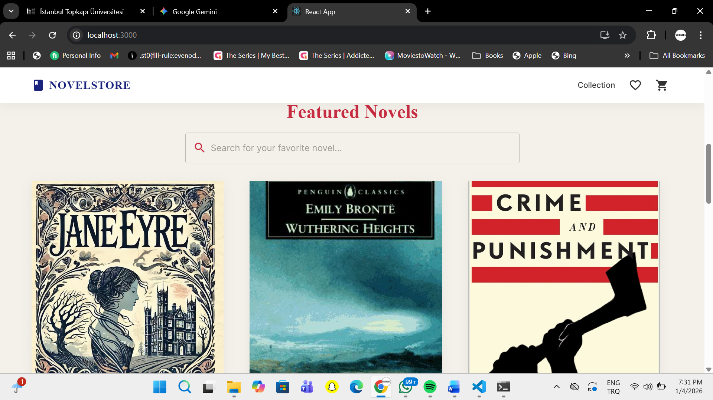
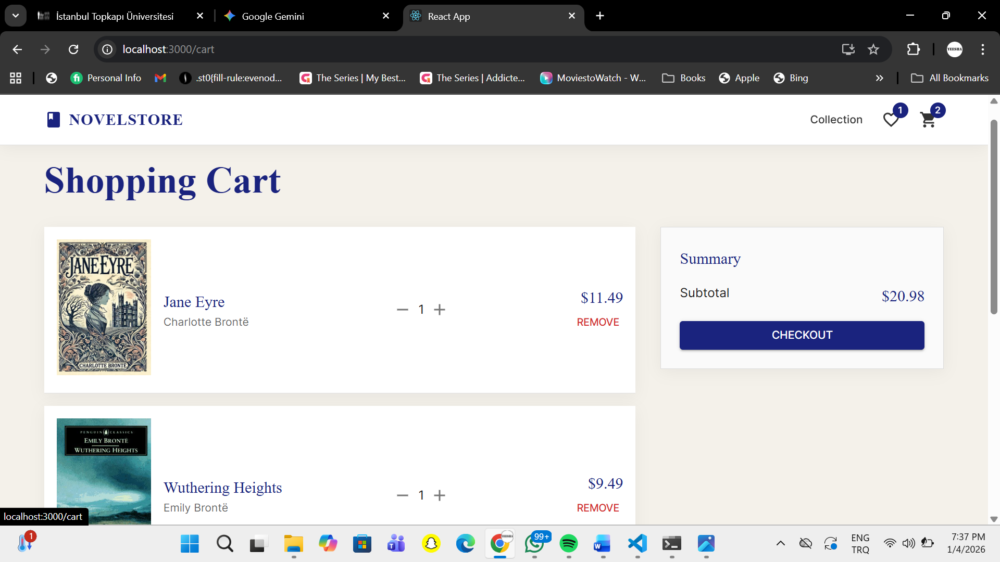
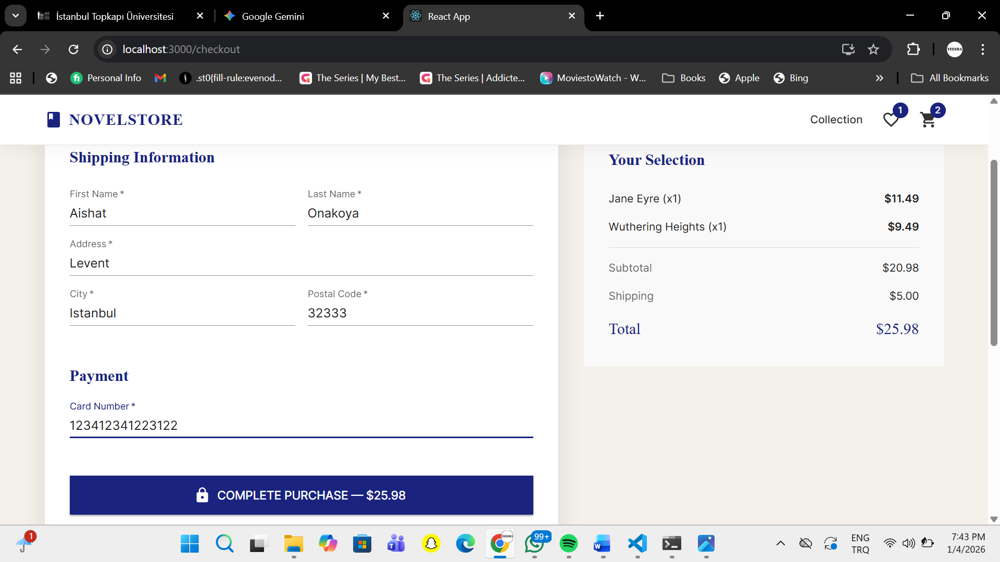

# Novel Store Project
**Student:** Aishat Fadekemi Gbemisola Onakoya  
**Student ID:** 22040102216  

## Project Overview
A full-stack e-commerce platform built with **React**, **Spring Boot**, and **PostgreSQL**. The application serves a library of 72 unique novel records with a focus on clean Material UI design and asynchronous data management.

## Repository Structure
According to the project requirements, all code is organized within the `SourceCode` directory:
* **SourceCode/frontend**: React.js application (Material UI & Axios).
* **SourceCode/backend**: Spring Boot REST API.
* **SourceCode/database**: SQL scripts and 72-record dataset.

## Quick Start
1. **Database**: Run the scripts in the `/database` folder on your PostgreSQL server.
2. **Backend**: Navigate to `/backend` and run `./mvnw spring-boot:run`.
3. **Frontend**: Navigate to `/frontend` and run `npm start`.

## Application Walkthrough

### User Interface & Browsing
I used **Material UI Grids** to ensure a professional and responsive layout for the store.
| Home Page - Primary View | Product Detail View |
| :---: | :---: |
|  |  |
|  | *Detailed view for 72 unique records* |

### Shopping & Checkout Process
The application handles a full e-commerce flow from cart management to final order placement.
| Cart Management | Order Processing |
| :---: | :---: |
|  |  |

### Responsive Design
The UI is fully mobile-responsive, adjusting components for smaller screen sizes seamlessly.

---
**Author:** Aishat Fadekemi Gbemisola Onakoya